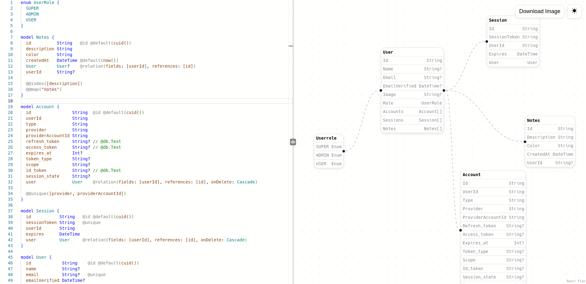

[TYPESCRIPT__BADGE]: https://img.shields.io/badge/typescript-D4FAFF?style=for-the-badge&logo=typescript
[REACT__BADGE]: https://img.shields.io/badge/React-005CFE?style=for-the-badge&logo=react
[VITE__BADGE]: https://img.shields.io/badge/Vite-7026b9?style=for-the-badge&logo=vite&logoColor=yellow
[CSS__BADGE]: https://img.shields.io/badge/css-005CFE?style=for-the-badge&logo=css&
[PROJECT__URL]: https://priagram.vercel.app/
[PROJECT__URL]: https://priagram.vercel.app/

<h1 align="center" style="font-weight: bold;">Priagram 💻</h1>

<div align="center">

![typescript][TYPESCRIPT__BADGE]
![css][CSS__BADGE]  
![react][REACT__BADGE]
![vite][VITE__BADGE]

</div>

<p align="center">
 <a href="#about">About</a> • 
 <a href="#backend">Backend</a> • 
 <a href="#started">Getting Started</a> • 
  <a href="#started">App Routes</a> • 
  <a href="#colab">Collaborators</a> •
 <a href="#contribute">Contribute</a>
</p>

<p align="center">
    
</p>

<h2 id="started">📌 About</h2>

this is a project to transform prisma models into a diagram to easy visualization of your database tables.
[link of the project here](https://priagram.vercel.app/)

<h2 id="started">🎒 Backend</h2>

You can access the backend [here](https://github.com/hxsggsz/priagram-backend)

<h2 id="started">🚀 Getting started</h2>

How to run this project

<h3>Prerequisites</h3>

Here you list all prerequisites necessary for running this project:

- [Git](https://git.com)
- [Node](https://nodejs.org/en/download)
- [pnpm](https://pnpm.io/pt/)

<h3>Fork</h3>

fork the project clicking in the fork button on github repository

<h3>Cloning</h3>

How to clone the project

```bash
git clone https://github.com/<your-github-username>/priagram-frontend.git
```

<h3>Starting</h3>

How to start the project

```bash
cd priagram-frontend
pnpm install
pnpm run dev
```

<h2 id="routes">📍 Application Routes</h2>
​
| route | description  
|----------------------|-----------------------------------------------------
| <kbd>/</kbd> | page with an code editor and the diagram canvas

<h2 id="colab">🤝 Collaborators</h2>

<table>
  <tr>
    <td align="center">
      <a href="https://github.com/hxsggsz/">
        <br>
        <sub>
          <b>Victor Hugo - hxsggsz</b>
        </sub>
      </a>
    </td>
  </tr>
</table>
